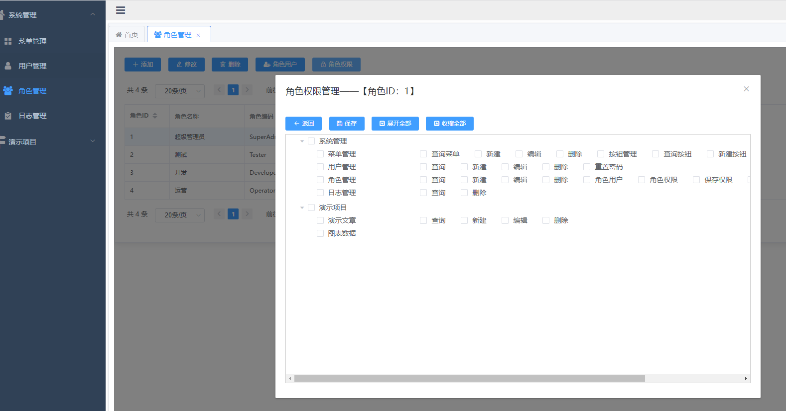
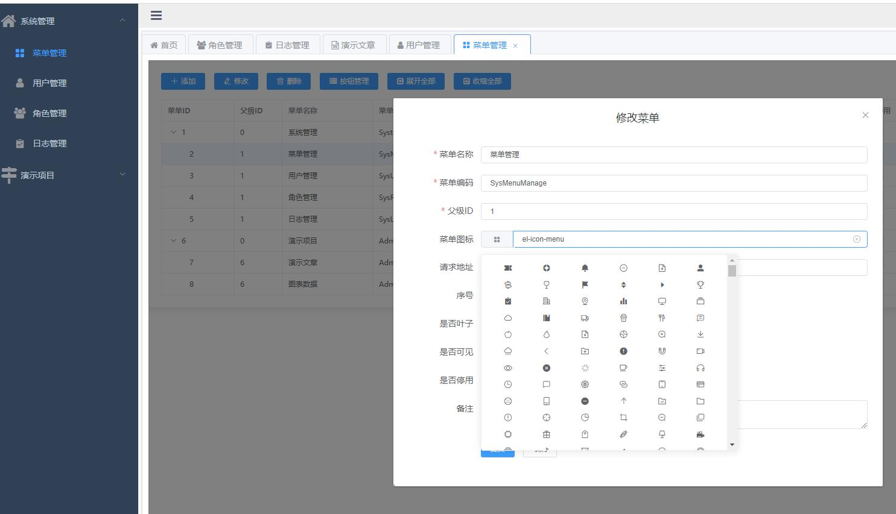
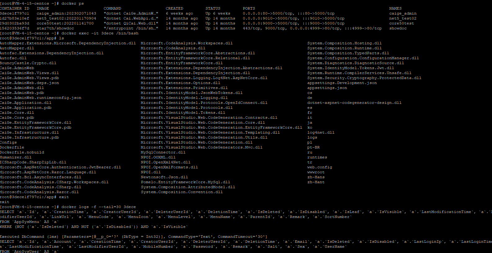
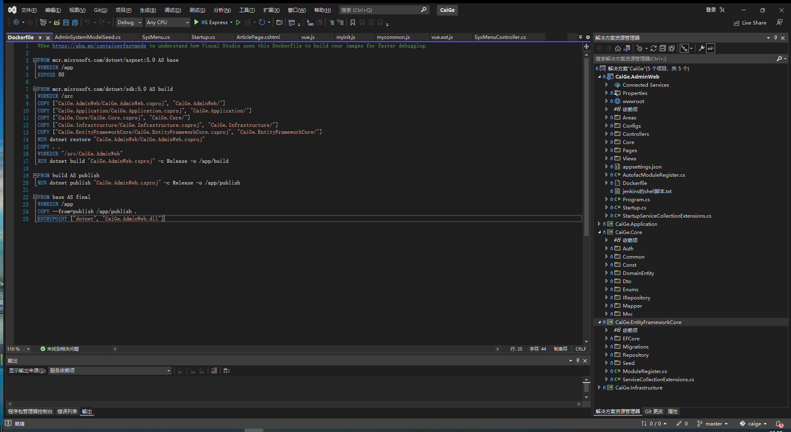
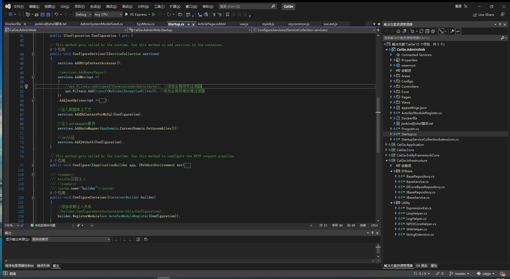

# 通用权限后台 MVC 版本

> NETCore5.0 + EF + MVC + elementUI 的通用权限后台管理系统 

> EFCore CodeFirst 数据迁移

> JWT 认证

> AutoMapper

> Log4net日志记录

> Autofac 依赖注入

> Jenkins一键发布 Linux Docker部署

> 权限控制粒度到了功能按钮

> 前端部分：Vue+axios+Element-ui

- 后台地址： [http://42.192.151.137/](http://42.192.151.137/)
- 账号： admin
- 密码： 123456

### :tada: 效果截图
<!-- 

 -->

<table>
    <tr>
        <td></td>
        <td></td>        
    </tr>
    <tr>
        <td></td>
        <td></td>        
    </tr>
    <tr>
        <td></td>
        <td></td>        
    </tr>
    <tr>
        <td></td>
        <td></td>        
    </tr>
    <tr>
        <td></td>
        <td></td>        
    </tr>
</table>